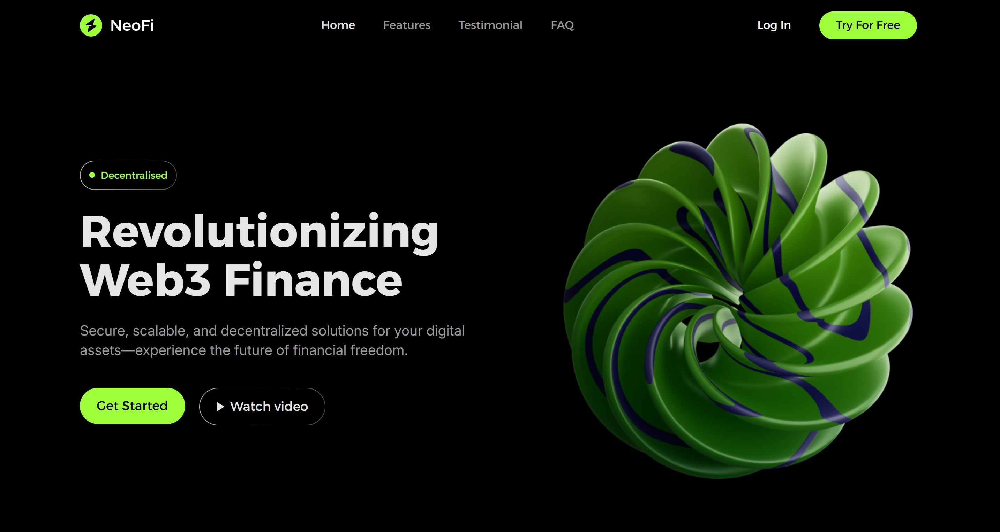
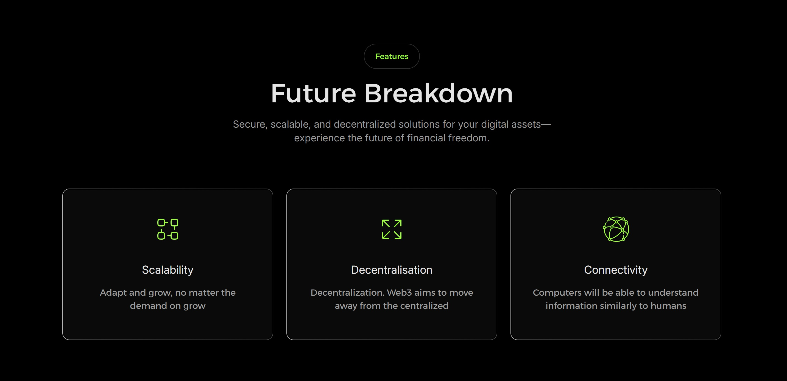
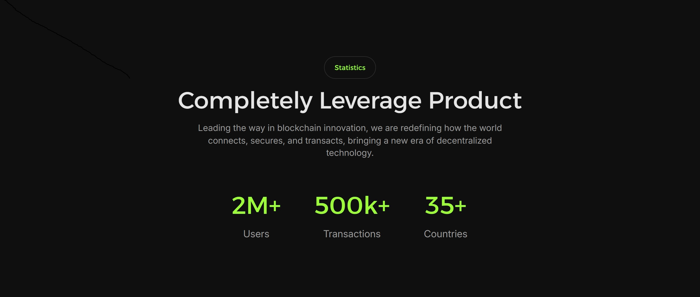
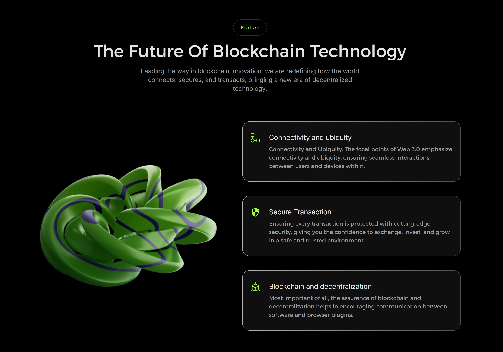
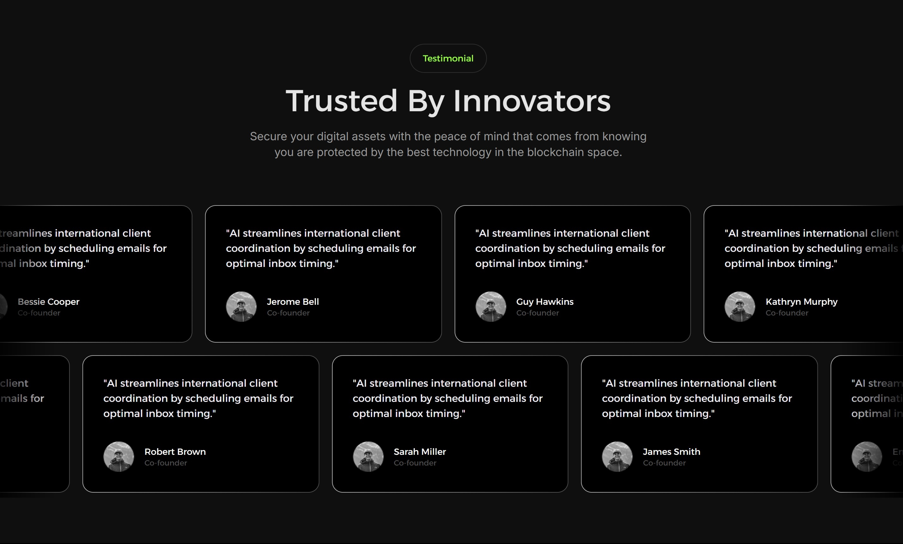
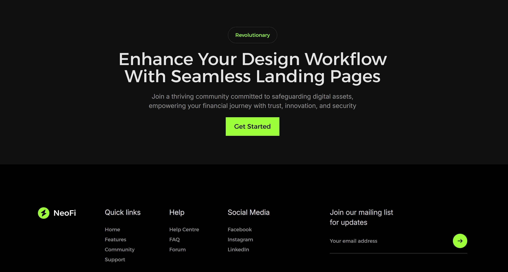

## NeoFi Service

This project transforms the static design concept into a living, breathing web application. Built with **React 19** and fully typed using **TypeScript**, brought to life with smooth animations and interactive components. Designed by **[Mohammad Ali](https://www.figma.com/@maliux)**. Original design **[here](https://www.figma.com/community/file/1472437465816738365/neofi-web3-landing-page)**.

- Styled with **Tailwind CSS**, leveraging a utility-first approach for responsive and scalable design
- UI components powered by **Shadcn** and **Radix UI**, ensuring consistent styling and flexible behavior across the app
- Enhanced user experience with dynamic and expressive animations using **Framer Motion**
- Interactive carousels implemented with **Swiper** and **Embla Carousel**, featuring autoplay, providing fluid content sliders
- Form handling and validation powered by **React Hook Form**, delivering robust and user-friendly form interactions
- Architected with modern development standards including **SEO**, **Accessibility** and proven code design principles like **DRY** and **KISS**



## Installation

```bash
$ git clone https://github.com/danielprzybytniewski/neofi-service
$ npm install
```

## Running the app

```bash
# Development mode
$ npm run dev

# Production build
$ npm run build
$ npm run preview
```

## License

This project is licensed under the MIT License.

## Screenshots










